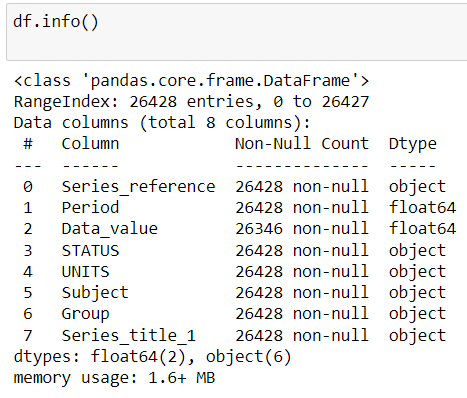
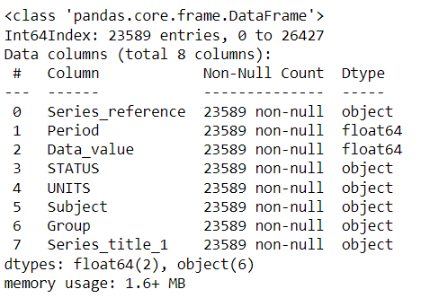

# EDA-SA04

# Data Set - food-price-index-2021.csv
```
DEVELOPED BY : SOWMIYA  N
REGISTER NO : 212221230106
```
## CODE
```
import pandas as pd
import numpy as np
import seaborn as sns

df=pd.read_csv("food-price-index-2021.csv")
df
df.info()
df.isnull().sum()

df["Data_value"]=df["Data_value"].fillna(df["Data_value"].median())
df.isnull().sum()
df.boxplot()

Q1 = df.quantile(0.25)
Q3 = df.quantile(0.75)
IQR = Q3 - Q1
print(IQR)
df_out = df[~((df < (Q1 - 1.5 * IQR)) |(df > (Q3 + 1.5 * IQR))).any(axis=1)]
print(df_out.shape)
df_out.boxplot()
df_out.info()

df["Series_reference"].value_counts()
df_out["Series_reference"].value_counts()

df["Period"].value_counts()
df_out["Period"].value_counts()
df["Data_value"].value_counts()
df_out["Data_value"].value_counts()
df["Series_title_1"].value_counts()
df_out["Series_title_1"].value_counts()

df_out

df_out.corr()
sns.heatmap(df_out.corr(),annot=True)
df.corr()
sns.heatmap(df.corr(),annot=True)

sns.countplot(x="Data_value",data=df_out)
sns.countplot(x="Period",data=df_out)

sns.displot(df_out["Period"])
sns.displot(df_out["Data_value"])

pd.crosstab(df_out["Data_value"],df_out["Series_title_1"])
pd.crosstab(df_out["Period"],df_out["Series_title_1"])

```
## OUTPUT
### Initial DataFrame:

### Number of Rows and Columns in the DataFrame:

### Sum of null data value present in each column:

### Graphical Representation - Before removing Outliers:

### Statistical Method (IQR) to remove Outliers from Dataset:


### Graphical Representation - After removing Outliers:

### Infromation on Number of rows and columns after removing Ouliers:

## EDA
### Statistical Method of Analyzation:
```
df - DataFrame before removing Outliers.

df_out - DataFrame after removing outliers.
```
### Insight about data in Column -Series_reference :

### Insight about data in Column -Period :

### Insight about data in Column -Data_value :

### Insight about data in Column -Series_title_1 :

### Graphical Method of Analyzation:
### DataSet after removing Outlier

### Correlation of columns:
```
df - DataFrame before removing Outliers.

df_out - DataFrame after removing outliers.
```


### Analyzation of Column - Data_value:

### Analyzation of Column - Period:

### Non Categorical Data- Distributive Plot:
### Column-Period:

### Column - Data_value:

### Statistical Method - Cross tabulation:
### Cross Tab of "Data_value" and "Series_title_1":

### Cross Tab of "Period and "Series_title_1":
